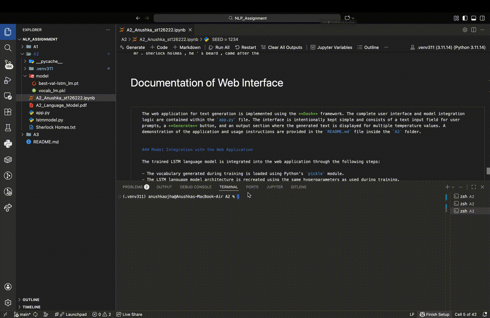

# A2 – LSTM Language Model for Text Generation

This project implements a word-level **LSTM-based language model** trained on the *Sherlock Holmes Collection*. The trained model is deployed as a **web application using Dash**, allowing users to enter a text prompt and generate continuations of the text at different temperature settings.

## Steps to Run the Web Application

* Go inside `A2/code` folder
* Run `python app.py`
* Go to `http://127.0.0.1:8050/` on the browser of your choice

---

## Demo

---

### Tasks

**1. Choose your dataset and provide a brief description. Ensure to source this dataset from reputable public databases or repositories. It is imperative to give proper credit to the dataset source in your documentation.**

The dataset used in this assignment is the Sherlock Holmes Collection obtained from Kaggle.**(https://www.kaggle.com/datasets/bharatkumar0925/sherlock-holmes-collection)**. It consists of the complete collection of public-domain novels and short stories written by Arthur Conan Doyle, including multiple Sherlock Holmes works. The dataset is provided in plain text format and represents a large continuous literary corpus suitable for language modeling.

**2. Detail the steps taken to preprocess the text data.**

The raw text dataset was first loaded from a plain text file containing the complete Sherlock Holmes collection. To prepare the data for language modeling, several preprocessing steps needs to be applied. Non-narrative content such as front matter, chapter titles, section headers, and metadata needs to be removed using rule-based filtering. Empty lines are to be discarded, and the text is to be trimmed to retain only meaningful narrative content. After cleaning, the text will be tokenized using the basic_english tokenizer from TorchText, which lowercases text and separates punctuation. Special tokens for unknown words (`<unk>`) and end-of-sequence (`<eos>`) will be added. Finally, the tokenized text will be converted into numerical form using a vocabulary constructed from the corpus, enabling it to be used as input for training the language model.

**3. Describe the model architecture and the training process.**

**Model Architecture**
The language model is implemented using a Long Short-Term Memory (LSTM) network, a type of recurrent neural network designed to capture long-range dependencies in sequential data. The LSTM contains memory cells and gating mechanisms that allow it to selectively remember or forget information from previous time steps. The input gate controls how much new information is written into the memory cell, the forget gate determines which information from the previous memory should be discarded or retained, and the output gate regulates how much information from the memory cell is exposed to the hidden state and output. This gating structure enables the model to effectively model long-term contextual relationships in text.

The language model is implemented using a Long Short-Term Memory (LSTM) network, a type of recurrent neural network designed to capture long-range dependencies in sequential data. The LSTM contains memory cells and gating mechanisms that allow it to selectively remember or forget information from previous time steps. The input gate controls how much new information is written into the memory cell, the forget gate determines which information from the previous memory should be discarded or retained, and the output gate regulates how much information from the memory cell is exposed to the hidden state and output. This gating structure enables the model to effectively model long-term contextual relationships in text.

In the implemented architecture, input tokens are first converted into dense vector representations using an embedding layer. These embeddings are then passed through stacked LSTM layers to capture temporal dependencies between words in the sequence. Dropout is applied to the embeddings and LSTM outputs to reduce overfitting by randomly deactivating neurons during training. Finally, a fully connected linear layer maps the LSTM hidden states to vocabulary-sized logits, which are used to predict the next word in the sequence.

**For Training**

Firstly, the model hyperparameters such as vocabulary size, embedding dimension, hidden dimension, number of LSTM layers, dropout rate, and learning rate are initialized. The Adam optimizer is used to optimize the model parameters, and the CrossEntropyLoss criterion is employed to compute the training loss.

The model is trained for a fixed number of epochs. In each epoch, the training data is divided into fixed-length sequences using the get_batch function. At the beginning of each epoch, the hidden state of the LSTM is reset. For every batch, the optimizer gradients are cleared, a forward pass is performed, and the loss is calculated by comparing the predicted probability distribution of the next token with the actual next token. Gradients are computed using backpropagation, and the model parameters are updated using the optimizer. The training loss is accumulated across all batches within an epoch.

After completing an epoch, the model is switched to evaluation mode, and the validation data is processed using the same batching procedure without updating model parameters. The validation loss is computed to assess model performance on unseen data. A learning rate scheduler adjusts the learning rate based on validation loss, and the model parameters are saved whenever the validation loss improves over previous epochs.

**4.Provide documentation on how the web application interfaces with the language model.**

The web application for text generation is implemented using the **Dash** framework. The complete user interface and model integration logic are contained within the `app.py` file. The interface is intentionally kept simple and consists of a text input field for user prompts, a **Generate** button, and an output section where the generated text is displayed for multiple temperature values. A demonstration of the application and usage instructions are provided in the `README.md` file inside the `A2` folder.

The trained LSTM language model is integrated into the web application through the following steps:

- The vocabulary generated during training is loaded using Python’s `pickle` module.
- The LSTM language model architecture is recreated using the same hyperparameters as used during training.
- Pre-trained model weights are loaded into the model using `torch.load`.
- A text generation function (`generate_text`) is defined, which tokenizes user input, converts tokens into numerical indices using the vocabulary, and generates new text using the trained LSTM model.
- Temperature values are applied during inference to control the randomness and diversity of generated text.

During inference, the model is run in evaluation mode. Predictions are sampled from the probability distribution produced by the model until either the maximum generation length is reached or an end-of-sequence token (`<eos>`) is encountered.

The interaction between the user, the web interface, and the language model follows these steps:

- The user enters a text prompt into the input field (e.g., *“Sherlock Holmes is”*).
- The user clicks the **Generate** button.
- The application passes the prompt to the language model.
- The model generates continuations of the prompt for multiple temperature values (0.1, 0.5, 0.7, 0.9, and 1.0).
- The generated text outputs are displayed on the web page, clearly labeled by temperature.

Since the language model is trained exclusively on the **Sherlock Holmes literary corpus**, prompts related to similar themes, characters, or narrative styles produce more coherent and meaningful outputs. Inputs unrelated to this domain may result in less sensible or generic text, reflecting the domain-specific nature of the trained model.
