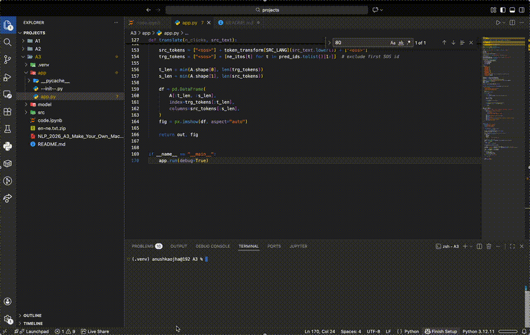

# **English–Nepali Neural Machine Translation with Attention**

This project implements a **Transformer-based Neural Machine Translation (NMT)** system for **English → Nepali** translation. The core focus is on comparing different **attention mechanisms** and selecting the most effective one for deployment in a web application.

The model is trained and evaluated using a parallel English–Nepali dataset from Hugging Face and visualizes attention weights through an interactive Dash web interface.

## **Dataset**

* **Name:** ne-en-parallel-208k
* **Source:** Hugging Face Datasets
* **Repository:**sharad461/ne-en-parallel-208k
* **Languages:** English (en), Nepali (ne)

The dataset consists of aligned English–Nepali sentence pairs and is well-suited for supervised machine translation. It is split into training, validation, and testing sets. For computational feasibility, reduced subsets were used during training.

## **Tokenization and Preprocessing**

* **English Tokenization:** spaCy tokenizer via TorchText
* **Nepali Tokenization:** WordPiece tokenizer from **nepalitokenizers**

Special tokens were defined as:

* **`<unk>`** (0): Unknown token
* **`<pad>`** (1): Padding token
* **`<sos>`** (2): Start of sentence
* **`<eos>`** (3): End of sentence

After tokenization, vocabularies were built using **build_vocab_from_iterator**, and all sequences were numericalized and padded for batch processing.

## **Experiment with Attention Mechanism (Final Epoch Results)**

| **Attention Variant** | **Training Loss** | **Training PPL** | **Validation Loss** | **Validation PPL** |
| --------------------------- | ----------------------- | ---------------------- | ------------------------- | ------------------------ |
| General                     | 8.958                   | 7773.531               | 8.951                     | 7719.025                 |
| Additive                    | 8.927                   | 7533.396               | 8.905                     | 7372.079                 |

From the experimental results, the **Additive Attention** mechanism consistently outperforms **General Attention** across all epochs. By the final epoch, the additive model achieves lower training and validation loss, along with reduced perplexity, indicating better sequence modeling and generalization.

This improvement is expected because additive attention computes alignment scores using a learned feed-forward network, allowing it to model more complex relationships between encoder and decoder states. In contrast, general attention relies on a simpler dot-product formulation, which is less expressive.

Although additive attention requires significantly higher computational time per epoch, the performance gains justify this cost, especially in low-resource translation tasks like English–Nepali, where precise word alignment is crucial.

## **Performance Analysis**

| **Attention Variant** | **Average Time per Epoch (s)** | **Overall Training Time (hrs)** | **Inference Time** | **Model Size (MB)** | **Test Loss** | **Test Perplexity** |
| --------------------------- | ------------------------------------ | ------------------------------------- | ------------------------ | ------------------------- | ------------------- | ------------------------- |
| General                     | 89.15                                | 0.57                                  | 0.0078 seconds           | 45.11                     | 8.954               | 7737.279                  |
| Additive                    | 407.53                               | 2.60                                  | 0.0047 seconds           | 45.11                     | 8.904               | 7361.088                  |

All models have the same size of **45.11 MB**, indicating that the choice of attention mechanism does not affect the number of learnable parameters. In terms of computational efficiency:

* **General Attention** trains significantly faster.
* **Additive Attention** is slower during training but achieves better test performance.

During inference, both mechanisms have very low latency. Interestingly, additive attention achieves slightly faster inference time, suggesting that once trained, it can generate translations efficiently.

## **Analysis of Results**

Based on the overall experiments, **Additive Attention** achieved the lowest validation and test loss as well as perplexity. Therefore, it was selected as the final model for deployment in the web application.

However, despite improvements in loss and perplexity, the overall translation quality remains limited. This may be due to:

* A relatively small number of training epochs
* Reduced dataset size for computational feasibility
* Training on CPU instead of GPU

Further improvements could be achieved by increasing training epochs, using larger datasets, or training on GPU-enabled hardware.

## **Demo**

  

