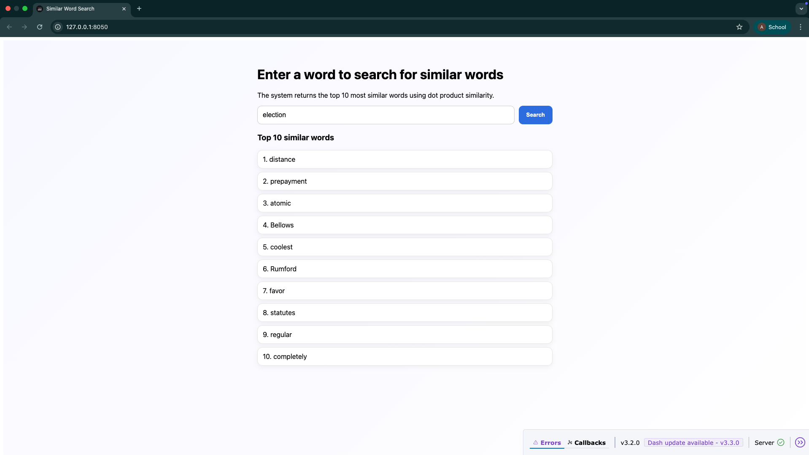

# NLP Assignment – Word Embeddings & Similarity Search

This repository contains the implementation of **Skip-gram**, **Skip-gram with Negative Sampling**, and **GloVe** models, along with a **web application** to search for similar words using trained embeddings.

**Prerequisites**

Make sure you have the following installed:

- Python 3.9+
- pip
- Jupyter Notebook
- Required Python libraries: pip install numpy torch nltk dash gensim scipy pandas matplotlib

**Project Structure:**

A1/
│── A1_Anushka_Ojha_st126222.ipynb        # Main notebook (model training & evaluation)
│── app.py                  # Dash web application
│── model/                  # Saved trained models & embeddings
│── images/                 # Screenshots for report
│── glove.6B/               # Pretrained GloVe vectors
│── README.md

**How to run the app**

* Go inside the A1 folder
* Run the Jupyter Notebook
* Run python app.py
* Open the http://127.0.0.1:8050 url in your browser.

**Screenshot of the app**

